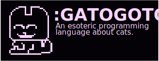

 

# :gatogoto [ALPHA]
An esoteric programming language about cats.

This is a little programming language i made with lua to prove myself i could code one.

```
# Hiiiii!!!!!
set $variable 2

:loop 
  mul $variable $variable 2
  meow $variable
  goto :loop
```

## functions/instructions available:
- `goto where:<number, section>`: Jumps to a line
- `sub/add/mul/div/pow/mod out:<variable> a:<variable, number>, b:<variable, number>`: Performs a math operation and saves the result
- `meow ...:<number, string, variable, boolean>`: It's like Lua's `print()`, but cooler.
- `set out:<variable> in:<number, string, variable, boolean>`: Sets out's value

## Planned things:
- `cmp` instruction or something similar to replace `if`
- proper documentation about everything
- proper string support (they bug out when you add spaces in them!)
- a cool and minimalistic website and repo, to prove how cool gatogoto is.
- a neat CLI thing to compile files and a nice cli input thing blablabla
- import instructions to copy over other files onto the source
- functions! ... kind of
- `r u s t    p o r t` 
